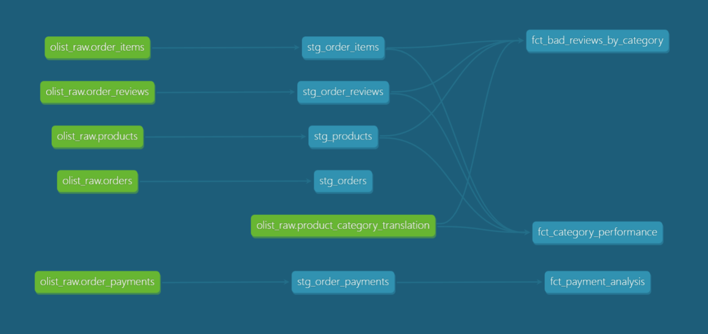
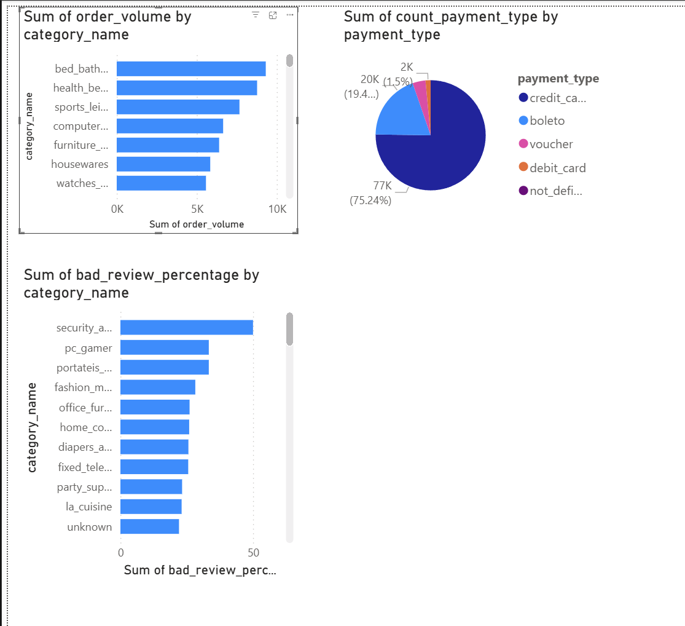

# Olist E-Commerce Analytics Pipeline

Production-grade ELT pipeline analyzing 100,000+ real Brazilian e-commerce orders to answer key business questions using DBT, PostgreSQL, and Power BI.

## Business Questions Answered
1. **Category Performance** — Which product categories have highest order volume and average rating?
2. **Payment Analysis** — What is the most used payment method and installment pattern?
3. **Bad Review Detection** — Which product categories have highest percentage of bad reviews (score ≤ 2)?

## Architecture

## Architecture

```
Raw CSVs (Kaggle)
      │
      ▼ Python ingestion
AWS RDS PostgreSQL - olist_raw schema
      │
      ▼ DBT transformation
AWS RDS PostgreSQL - olist_dev schema
      │
      ├── Staging Layer (5 views)
      │   stg_orders, stg_order_items, stg_order_payments
      │   stg_order_reviews, stg_products
      │
      ├── Dimension Layer (3 tables)
      │   dim_products, dim_customers, dim_date
      │
      └── Marts Layer (4 tables)
          fct_orders (central fact table)
          fct_category_performance
          fct_payment_analysis
          fct_bad_reviews_by_category
      │
      ▼
Power BI Dashboard
```

## Star Schema Design

                dim_date
                   │
dim_customers → fct_orders ← dim_products

- **Fact table** — stores keys and metrics (price, freight_value)
- **Dimension tables** — stores descriptive context (category, city, date attributes)
- Any business question answered by joining fact + relevant dimensions


## Tech Stack
- **DBT Core 1.11** — data transformation, testing, documentation
- **AWS RDS PostgreSQL** — cloud data warehouse (ap-south-1)
- **Apache Airflow** — pipeline orchestration
- **Power BI** — business intelligence dashboard
- **Python** — data ingestion scripts

## Dataset
- Source: [Brazilian E-Commerce Public Dataset by Olist](https://www.kaggle.com/datasets/olistbr/brazilian-ecommerce)
- Scale: 100,000+ orders, 112,000+ order items, 99,000+ reviews

## Key Features
- 3 layer DBT architecture — staging → marts
- 11 automated data quality tests
- Portuguese → English category name translation
- NULL handling with COALESCE fallback to 'Unknown'
- Full pipeline documentation with DBT lineage graph

## Key Insights
- **Credit card** is the dominant payment method (76,505 orders, avg 3.5 installments)
- **Bed, bath & table** is the highest volume category (9,313 orders)
- **Office furniture** has the most statistically significant bad review rate (26% from 1,687 reviews)

## Pipeline Models
| Model | Layer | Type | Business Question |
|---|---|---|---|
| stg_orders | Staging | View | Base order data |
| stg_order_items | Staging | View | Item level pricing |
| stg_order_payments | Staging | View | Payment details |
| stg_order_reviews | Staging | View | Customer ratings |
| stg_products | Staging | View | Product categories |
| fct_category_performance | Marts | Table | Q1 — Category performance |
| fct_payment_analysis | Marts | Table | Q2 — Payment patterns |
| fct_bad_reviews_by_category | Marts | Table | Q3 — Bad review detection |

## Pipeline Lineage


## Dashboard
